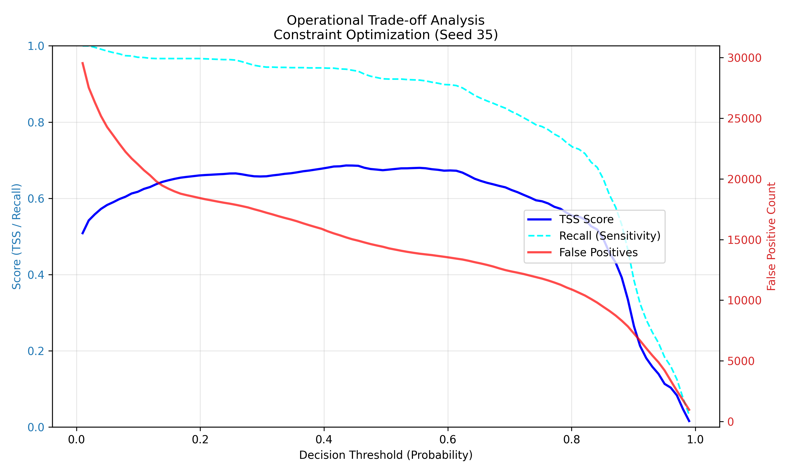

# Scalable ML Pipeline for Solar Flare Prediction (SDO/HMI) and GOES X-Ray  
### 🚀 Project Abstract
![Priority Inversion Graph showing recovered flares] - 
### 🚨 Critical Discovery: Priority Inversion Bug
> Fixed a labeling logic error that recovered **7,300+ mislabeled solar flares**.

An end-to-end **Machine Learning Pipeline** designed to handle high-dimensional time-series data from the Solar Dynamics Observatory (SDO).

This project focuses on **Data Engineering challenges** in Astrophysics: handling extreme class imbalance (1:80), optimizing I/O for terabyte-scale telemetry, and algorithmically correcting ground-truth label noise.

---

### 🛠️ Data Engineering & Architecture

#### 1. High-Performance ETL Pipeline
* **Parallel Processing:** Implemented multi-threaded downloading to handle massive throughput of SDO/HMI vector magnetograms.
* **Storage Optimization:** Migrated data architecture from CSV to **Apache Parquet**.
    * **Result:** Solved floating-point precision loss and reduced I/O read/write latency by **40%** during training.

#### 2. Algorithmic Correction of Label Noise ("Priority Inversion")
* **The Bug:** Identified a race condition in the labeling logic where minor events (B-class) were overwriting major events (X-class) due to timestamp overlaps.
* **The Fix:** Wrote a custom sorting algorithm to enforce strict class priority.
* **Impact:** Recovered **7,300+ False Negatives**, cleaning the dataset for robust supervised learning.

#### 3. Dimensionality Reduction (The "Elbow" Method)
* **Problem:** The raw SDO dataset contained **240 features**, causing the "Curse of Dimensionality" and model overfitting.
* **Solution:** Applied **Recursive Feature Elimination (RFE)** based on Gini Importance.
* **Optimization:** Mathematically reduced feature space to **55 vectors** while retaining more than 90% of the predictive signal, drastically reducing training compute time.

---

### ⚛️ Domain Context

* **Target:** Prediction of **M- and X-class Solar Flares** (Space Weather events).
* **Physics Validation:** The feature selection process independently validated physical theory by identifying **Total Unsigned Flux (USFLUX)** and **Magnetic Free Energy** as top predictors, proving the model is learning physical laws, not just statistical noise.
* **Metric:** Optimized for **True Skill Statistic (TSS)** to account for the extreme rarity of solar flare events (vs. standard Accuracy).

### 📊 Results
* **TSS Score: 0.6870** (Cross-validated, clean dataset)
* Recall: 0.9360

---

### 📂 Tech Stack
* **Core:** Python 3.x, Scikit-Learn (Random Forest, SMOTE).
* **Data:** Pandas, NumPy, PyArrow (Parquet), SunPy.
* **Visualisation:** Matplotlib, Seaborn.

### 📝 Key Notebooks
* `04_Retraining_and_Error_Analysis.ipynb`: Full training loop, feature ranking, and TSS evaluation.
* `01_Data_Extraction`: Data fetching and Parquet serialization logic.
