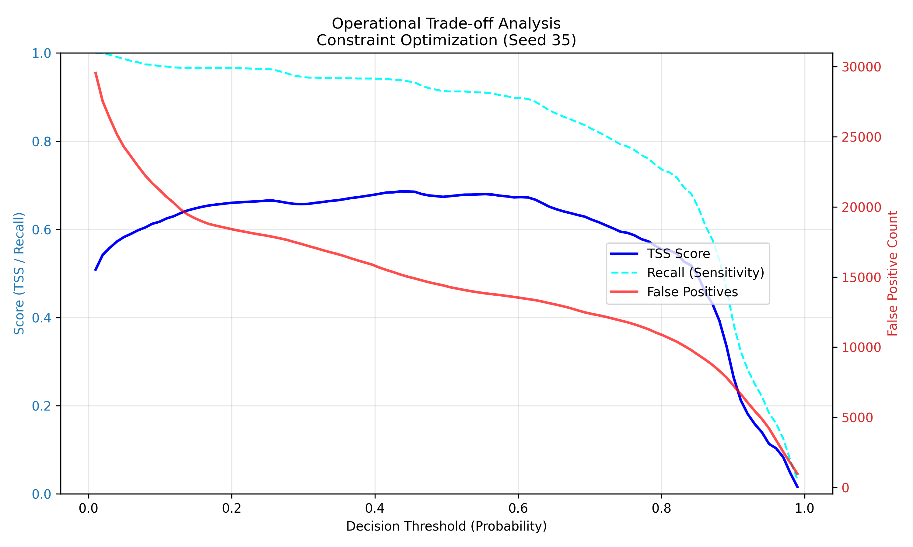

# Scalable ML Pipeline for Solar Flare Prediction (SDO/HMI) and GOES X-Ray

### 🚀 Project Abstract

Binary classification: will an M- or X-class GOES flare start within 24 hours of a given SDO/HMI SHARP magnetogram record? Data: 2014 to 2015 (Solar Cycle 24 maximum). Models: XGBoost and Balanced Random Forest (BRF) on tabular SHARP parameters, tuned with Optuna and scored with TSS.

**Status:** manuscript in preparation. Code and results as of October 2026.

This project is about data quality and honest evaluation, not about beating published flare forecasters. Main findings:

1. **Label bug:** a label-overwrite bug in the labeling loop hid most of the positive class. Fixing it changed the M+X positives from 1,143 to 8,365.
2. **Leakage:** a plain random split inflated test TSS to 0.9175. Splitting by active region gives about 0.65.
3. **Static baseline:** a single-feature rule (USFLUX above the training median) gets TSS 0.4622, about 70% of the models' 0.645. The models add about 0.18 mainly by cutting false alarms.
4. **Model comparison:** XGBoost (0.6450) and BRF (0.6499) are effectively tied under leak-free evaluation.

**Quick glossary**
* **Active region (AR):** a patch of strong magnetic field on the Sun that produces flares.
* **TSS (True Skill Statistic):** recall minus false positive rate. 0 means no skill, 1 is perfect.
* **Recall:** the fraction of real flares the model catches.
* **Precision:** the fraction of the model's flare alarms that are real.
* **FPR (false positive rate):** the fraction of non-flare records wrongly flagged as flares.
* **Threshold:** the probability cutoff above which the model says "flare".
* **Leakage:** when the test set shares information with the training set, which inflates scores.

---

### 🚨 Key Finding: Priority Inversion Bug

> Fixing the label-overwrite bug recovered **7,222 mislabeled positive samples** (1,143 to 8,365).

A record is positive if an M or X flare from the same `NOAA_AR` starts in `[T_REC, T_REC + 24 h)`. The original loop assigned classes in the order X, M, C, B and overwrote earlier labels, so a weak flare later in the loop erased a strong flare's label inside overlapping windows.

Controlled ablation (only the loop order changed):

| Class | Descending (buggy) | Ascending (fixed) | Delta |
|---|---|---|---|
| X | 16 | 1,096 | +1,080 |
| M | 1,127 | 7,269 | +6,142 |
| C | 37,117 | 32,060 | -5,057 |
| B | 4,824 | 2,659 | -2,165 |
| Non-flare | 638,374 | 638,374 | 0 |
| **Positive (M+X)** | **1,143** | **8,365** | **+7,222** |

The counts balance exactly (1,080 + 6,142 = 5,057 + 2,165), and the unchanged non-flare count shows the matching logic stayed constant. A version that always keeps the strongest class makes the bug impossible. The corrected positive class is about 1 in 80 records.

---

### 🛠️ Data and Pipeline

| Item | Value |
|---|---|
| Raw SHARP records (2014 to 2015) | 918,328 |
| Raw GOES flare records | 2,299 |
| Records after cleaning | 681,458 |
| Model-ready rows (after features and NaN drop) | 578,993 |

* **Extraction:** SHARP parameters and flare records fetched with SunPy and saved as Apache Parquet (notebook `01`).
* **Cleaning:** parsed `T_REC`, sorted by (HARPNUM, T_REC), removed duplicates (none found). The 35 s TAI to UTC offset has a negligible effect on labels.
* **Observation gaps:** 5,055 records (0.87%) come right after a gap of more than 24 minutes. My "change over 6 hours / 12 hours" features assume evenly spaced data, so they are inaccurate for these records (up to about 38.6k records for the 6 h feature, 77.2k for 12 h).

**Features:** 16 base SHARP parameters, 2 physics ratios (`TOTUSJH/USFLUX`, `TOTUSJZ/USFLUX`), 6 h and 12 h deltas, and rolling statistics. Dropping the rolling statistics raised test TSS from 0.6583 to 0.6870 and shrank the train-test gap from 0.1810 to 0.1410, so all final models use the **55-feature** set.

**Splitting:** `GroupShuffleSplit` on HARPNUM (so no active region appears in both train and test), test size 0.10, seed 35. Train: 517,418 rows (6,486 positives). Test: 61,575 rows (1,468 positives) from 8 flare-producing regions (11947, 11968, 11996, 12055, 12113, 12209, 12222, 12241). Seed 35 was chosen from seeds 0 to 99 by counting flaring test regions, before any training.

**Tuning:** Optuna (50 trials), 5-fold GroupKFold, TSS objective. Different sampler seeds found different best parameters, so these are "best found", not provably optimal.

---

### 📊 Results

To avoid cheating, the cutoff for "flare / no flare" was picked using training data only, and the test set was used once.

| Model | Threshold | TSS | Recall | FPR | Precision | FP | FN |
|---|---|---|---|---|---|---|---|
| XGBoost | 0.47 | 0.6450 | 0.8638 | 0.2187 | 0.0880 | 13,148 | 200 |
| Balanced Random Forest | 0.32 | 0.6499 | 0.9666 | 0.3168 | 0.0694 | 19,040 | 49 |

* The TSS difference is tiny on an 8-region test set, so neither model wins.
* XGBoost gives 30.9% fewer false positives than BRF and 10.3 points less recall.
* Precision is 7 to 9%, about 10 to 14 false alarms per hit, so these models are not operationally usable.
* An earlier threshold scan on the test set gave XGBoost 0.7163 and BRF 0.6814. Those are optimistic and kept only for transparency.

**Static baselines** (thresholds from training data only, same test set):

| Rule | TSS | Recall | FPR | Precision |
|---|---|---|---|---|
| Region already flared | 0.1947 | 0.7262 | 0.5315 | 0.0323 |
| USFLUX above training median | 0.4622 | 1.0000 | 0.5378 | 0.0434 |
| XGBoost | 0.6450 | 0.8638 | 0.2187 | 0.0880 |
| BRF | 0.6499 | 0.9666 | 0.3168 | 0.0694 |

A one-feature rule already reaches about 70% of the models' TSS, so much of the skill is static region size. The models add about 0.18 TSS mostly by reducing false alarms.

<!--  -->

---

### 🔬 Diagnostics

**Recall by hours before the flare**:

| Lead time | n | Recall | TSS | Already flared |
|---|---|---|---|---|
| 0 to 6 h | 480 | 0.9708 | 0.7526 | 73.3% |
| 6 to 12 h | 432 | 0.8773 | 0.6590 | 71.8% |
| 12 to 18 h | 289 | 0.8997 | 0.6814 | 70.6% |
| 18 to 24 h | 266 | 1.0000 | 0.7817 | 74.8% |

* Skill does not decay with lead time, which is not what precursor detection would produce.
* 1,066 of 1,468 test positives (72.6%) come from regions that had already produced an M/X flare.
* On first-flare-only records (n = 402), recall across the bins is 0.8906 / 0.5656 / 0.6588 / 1.0000, so mid-horizon recall drops once repeat flarers are removed.
* Each bin has only 6 to 8 unique active regions, and one test region (HARPNUM 3587, 49 positives) gets zero true positives.

**Takeaway:** the models are not forecasting flares 24 hours ahead. Their skill comes mostly from recognizing large, magnetically extreme, already-flaring regions.

---

### ⚠️ Limitations

* **Small test set:** only 8 flare-producing regions, so small differences between models are not meaningful.
* **Random-in-time split:** train and test both span 2014 to 2015, so the evaluation tests interpolation within the observed window, not extrapolation to unseen solar-cycle conditions. A train-2014/test-2015 split is not yet run. Its result would mix model error with year-to-year solar-cycle drift (flare rate and positive counts differ between years), so it should be read as a stress test, not a pure leakage measure.* **Baseline threshold:** the USFLUX baseline uses the training median, not a tuned threshold.
* **Observation gaps:** I measured how many records are affected but did not retrain to see the effect on results.
* **False alarms:** precision is below 9%. I did not try training the model to punish missed flares more than false alarms.

---

### 📂 Tech Stack

* **Core:** Python 3.x, scikit-learn, imbalanced-learn (BRF), XGBoost, Optuna, Numba.
* **Data:** Pandas, NumPy, PyArrow (Parquet), SunPy.
* **Visualisation:** Matplotlib.

### 📝 Key Notebooks

* `01_Data_Extraction.ipynb`: data fetching and Parquet serialization.
* `02_Data_Cleaning.ipynb`: parsing, de-duplication, labeling.
* `03_Model_Training.ipynb`: features, Optuna tuning, training.
* `04_Retraining_and_Error_Analysis.ipynb`: retraining on corrected labels, TSS evaluation, diagnostics.
* `Consolidated Results from the Project.ipynb`: results summary.
